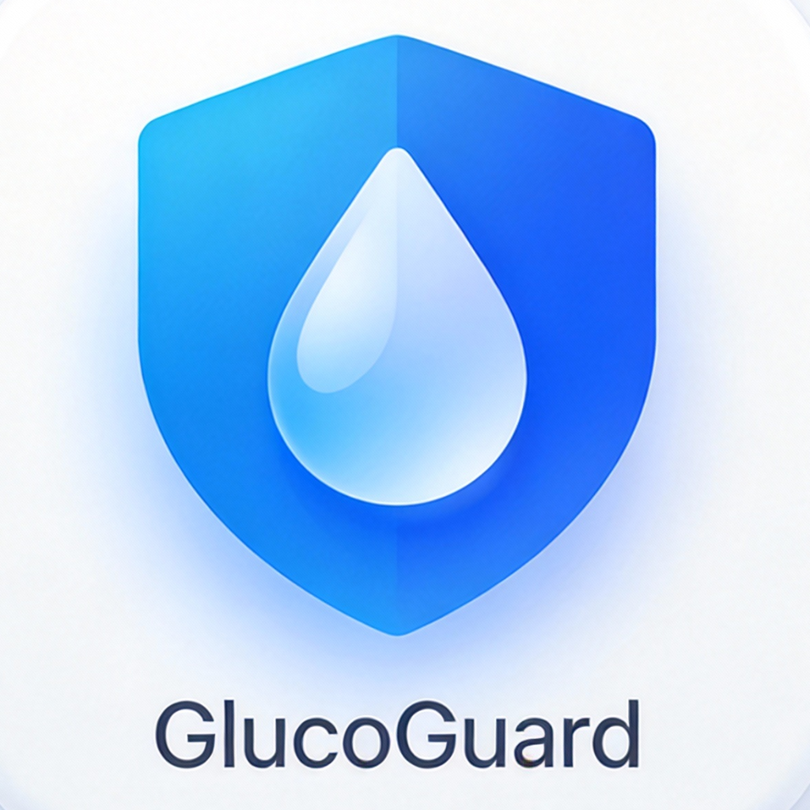

# GlucoGuard 糖卫士 (SugarGuard iOS Native)

<p align="center">
  
</p>

<p align="center">
  <b>您的 AI 贴身控糖专家 | 智能血糖管理 iOS 客户端</b>
</p>

---

## 📖 项目简介 (Introduction)

**GlucoGuard 糖卫士** 是一款基于 SwiftUI 开发的原生 iOS 应用，致力于利用前沿的 AI 技术帮助糖尿病患者更轻松、更科学地管理血糖。

本项目秉持 **"科技向善"** 的理念，承诺核心功能完全免费，且数据隐私安全。我们希望通过技术手段，降低慢病管理的门槛，让每一位糖友都能享受到科技带来的便利。

## ✨ 核心亮点 (Features)

*   **🤖 AI 智能健康顾问**: 内置 DeepSeek 大模型，根据您的血糖数据、年龄和病史，提供像内分泌专家一样温暖、专业的个性化建议。
*   **📸 OCR 拍照秒录**: 告别繁琐的手写，对着血糖仪拍张照，AI 自动识别读数并记录，准确率高达 99%。
*   **🎙️ 语音一键记录**: 专为老年人优化，按住说话即可自动提取血糖数值，动口不动手。
*   **📊 可视化趋势分析**: 精美的动态折线图与周/月报表，一眼看清血糖波动规律，辅助医生精准调药。
*   **💊 智能用药提醒**: 自定义药物计划，准时弹窗提醒，不再担心漏服。
*   **🔒 隐私安全第一**: 采用 "Local-First" 架构，核心健康数据默认仅存储在本地沙盒，您的隐私由您掌控。

## 🛠️ 技术栈 (Tech Stack)

*   **Language**: Swift 5.0
*   **UI Framework**: SwiftUI (MVVM Architecture)
*   **AI Integration**: DeepSeek API (RESTful)
*   **On-Device ML**: Vision Framework (OCR), Speech Framework (ASR)
*   **Data Storage**: Codable / JSON Persistence
*   **Minimum Target**: iOS 16.0+

## 📂 目录结构 (Structure)

详细的架构说明请参阅 [TECHNICAL_ARCHITECTURE.md](SoftwareApply/TECHNICAL_ARCHITECTURE.md)。

## 🚀 快速开始 (Getting Started)

1.  **克隆仓库**
    ```bash
    git clone https://github.com/liuujiaxing-cmd/sugarguard-ios-native.git
    cd sugarguard-ios-native
    ```

2.  **打开项目**
    双击 `SugarGuard.xcodeproj` 在 Xcode 中打开。

3.  **配置签名**
    在 Xcode -> Targets -> Signing & Capabilities 中，选择您的开发者 Team。

4.  **运行**
    选择模拟器 (推荐 iPhone 15 Pro) 或真机，点击 Run (Cmd + R)。

## 🤝 贡献与支持 (Contribution & Support)

*   **技术支持**: 访问 [GitHub Support Repo](https://github.com/liuujiaxing-cmd/glucoguard-support) 提交 Issue。
*   **隐私政策**: [Privacy Policy](InformationAndVersion/PRIVACY_POLICY.md)
*   **版本记录**: [Version History](InformationAndVersion/VERSION_HISTORY.md)

## 📄 许可证 (License)

本项目采用 MIT 许可证。详情请见 [LICENSE](LICENSE) 文件。

---
*Built with ❤️ by Liu Jiaxing*
